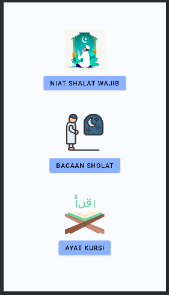
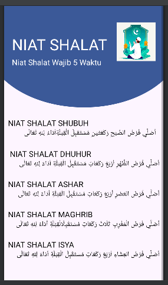
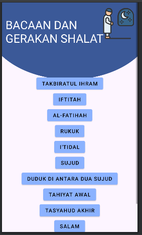
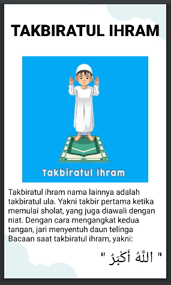
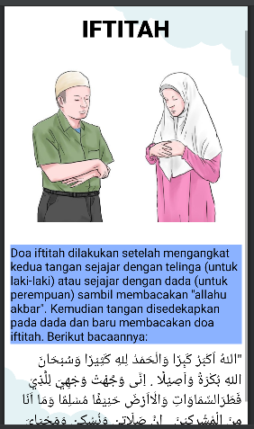
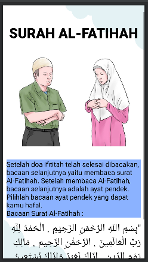
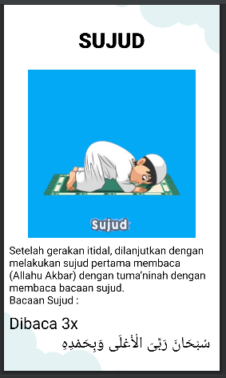
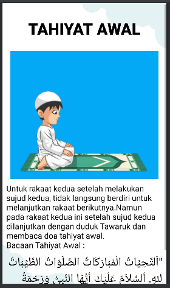
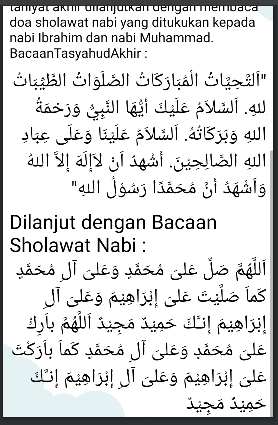
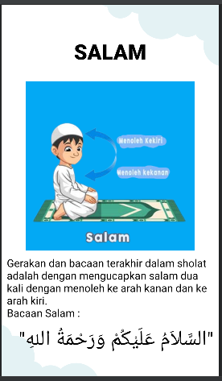

# Laporan Mini Project
Pemrograman Mobile
"Aplikasi Bacaan Shalat Berbasis Android"

Oleh Kelompok BARAKALLAH :
Fathin Naufaliya (2041723015)
Muhammad Tyone Nur Satria (2041723006)
Thalia Amira Rifda (2041723005)

Politeknik Negeri Malang
Jurusan D4 Teknik Informatika
November 2021

1. HALAMAN UTAMA

2. Halaman Menu Niat Sahalat Wajib

3. Halaman Menu Bacaan Shalat

4. Halaman Takbiratul Ihram

5. Halaman Iftitah

6. Halaman Al-Fatihah

7. Halaman Rukuk

8. Halaman I'tidal

9. Halaman Sujud

10. Halaman Duduk Diantara Dua Sujud

11. Halaman Tahiyat Awal

12. Halaman Tasyahud Akhir

13. Halaman Salam

14. Halaman Menu Ayat Kursi

